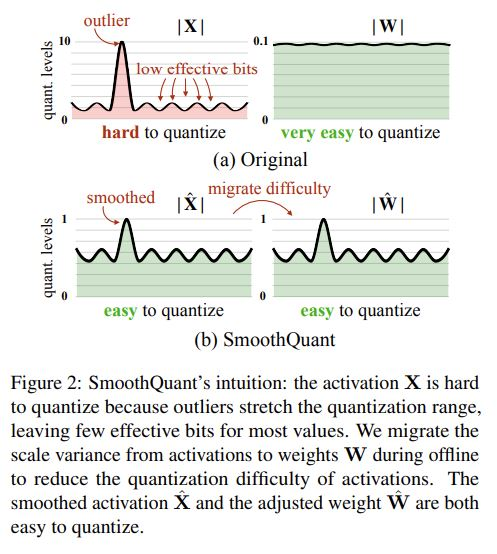
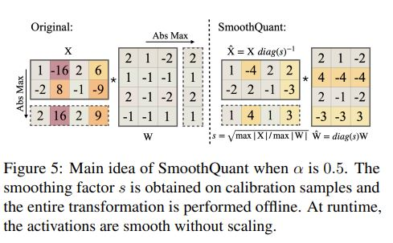

# SmoothQuant: Accurate and Efficient Post-Training Quantization for Large Language Models

## Core Idea
[kimi] 结论：介绍了一种名为SmoothQuant的技术，它是一种针对大型语言模型（LLMs）的准确且高效的后训练量化（post-training quantization, PTQ）解决方案。SmoothQuant的目标是实现8位权重和激活（W8A8）的量化，以减少内存使用并加速推理过程，同时保持模型的准确性。

[kimi] SmoothQuant方法：SmoothQuant通过一种数学等价的转换，将量化难度从激活迁移到权重，从而平滑激活中的异常值。这种方法允许对LLM中的所有矩阵乘法操作进行INT8量化，包括多种流行的模型如OPT、BLOOM、GLM等。

[kimi] 对比LLM.int8()

LLM.int8和SmoothQuant都是针对大型语言模型（LLMs）的量化方法，旨在减少模型的内存占用并加速推理过程。以下是这两种方法的对比：

LLM.int8()
- 目标：LLM.int8专注于将Transformer模型的权重和激活量化到8位精度，同时保持与更高精度相当的性能。
- 方法：它采用混合精度分解技术，对大部分值进行8位量化，并对少数异常值使用16位精度，以确保模型性能不受影响。
- 优势：显著减少内存占用，使得大型模型能够在有限的硬件资源上运行，同时保持了模型的预测性能。
- 适用性：LLM.int8特别适用于那些在6.7亿参数规模以上出现的极端特征，通过混合精度处理这些特征来避免性能下降。
- 实现：需要对模型进行特定的量化和去量化处理，可能涉及额外的计算开销。

SmoothQuant
- 目标：SmoothQuant旨在通过后训练量化（PTQ）方法，实现对大型语言模型的准确且高效的量化，同时保持模型的原始性能。
- 方法：它通过数学等价的变换来平滑激活分布，将量化难度从激活迁移到权重，从而实现权重和激活的8位量化。
- 优势：提供了一种无需重新训练、准确且高效的量化方法，使得大型模型能够在保持原始性能的同时，减少内存占用和加速推理过程。
- 适用性：SmoothQuant适用于需要在单个节点上服务大型模型的场景，如在单个GPU上运行530B参数的模型。
- 实现：通过调整迁移强度参数α来平衡权重和激活的量化难度，适用于不同的模型架构和统计特性。

对比总结
- 内存和性能：LLM.int8和SmoothQuant都旨在减少内存占用并保持模型性能，但LLM.int8通过混合精度分解来处理极端特征，而SmoothQuant通过平滑激活分布来实现。
- 实现复杂性：LLM.int8可能需要更复杂的实现来处理混合精度计算，而SmoothQuant则通过简化的量化过程来减少实现的复杂性。
- 适用场景：LLM.int8特别适合处理大规模模型中的极端特征，而SmoothQuant提供了一种更通用的量化解决方案，适用于多种不同的模型架构。

两种方法各有优势，选择哪一种取决于具体的应用场景、模型特性和硬件限制。在实际应用中，可能需要根据具体情况进行权衡和选择。

## Core Image

## Useful Extensions
Code: https://github.com/mit-han-lab/smoothquant

Integrated into NVIDIA TensorRT-LLM: https://github.com/NVIDIA/TensorRT-LLM

[大语言模型推理加速技术：模型压缩篇](https://zhuanlan.zhihu.com/p/667455383)